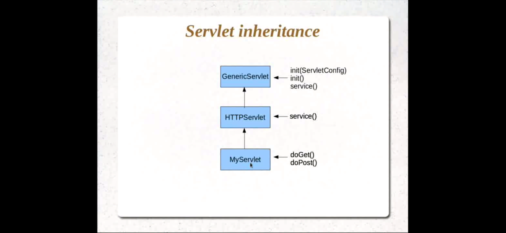
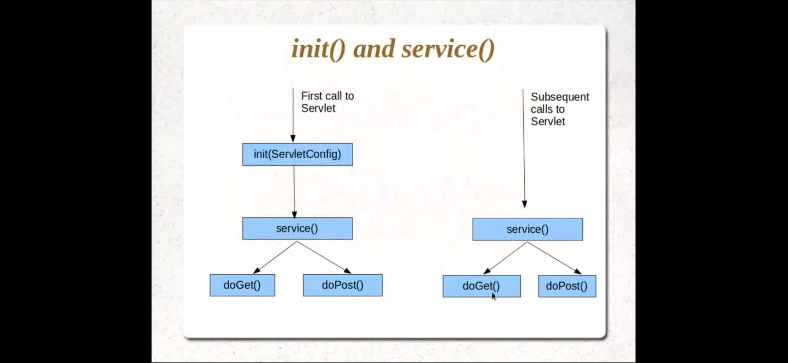
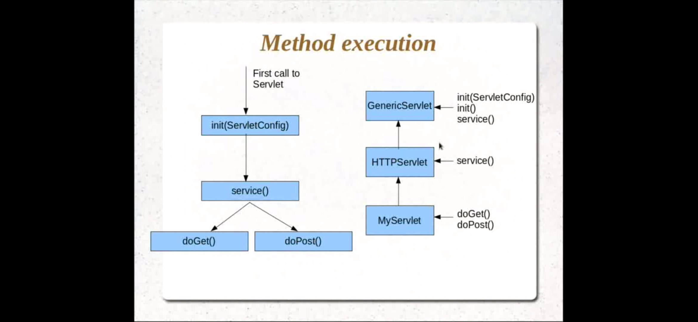

# Servlets - Life Cycle

1. Servlet Inheritance

2. init() vs service()

3. Request Execution

- Servlet is normally created when a user first invokes a URL corresponding to the servlet 
- Servlet is initialized by calling the init() method
- Servlet calls service() method to process a client's request
- Servlet is terminated by calling the destroy() method
- Finally, servlet is garbage collected by the garbage collector of the JVM

---

### init() Method

- The servlet container calls the init method exactly once after instantiating the servlet. The init method must complete successfully before the servlet can receive any requests
- When a user invokes a servlet, a single instance of each servlet gets created, with each user request resulting in a new thread

### service() Method

- The servlet container (i.e. web server) calls the service() method to handle requests coming from the client( browsers) and to write the formatted response back to the client
- Each time the server receives a request for a servlet, the server spawns a new thread and calls service. The service() method checks the HTTP request type and calls methods as appropriate (doGet,doPost,...)

### destroy() Method

- The destroy() method is called only once at the end of the life cycle of a servlet. And it will not call the service method again on this servlet
- This method gives the servlet an opportunity to clean up any resources that are being held (for example, memory, file handles, threads)