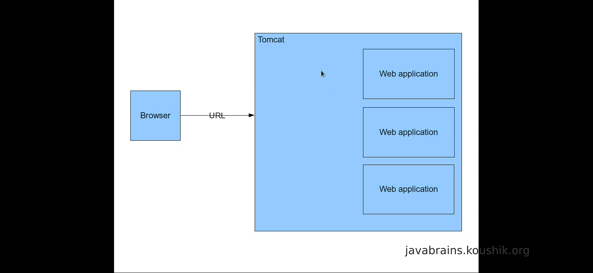
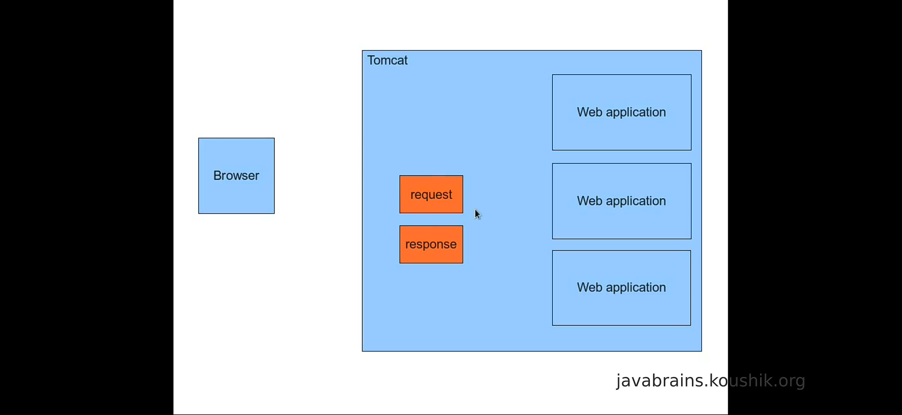
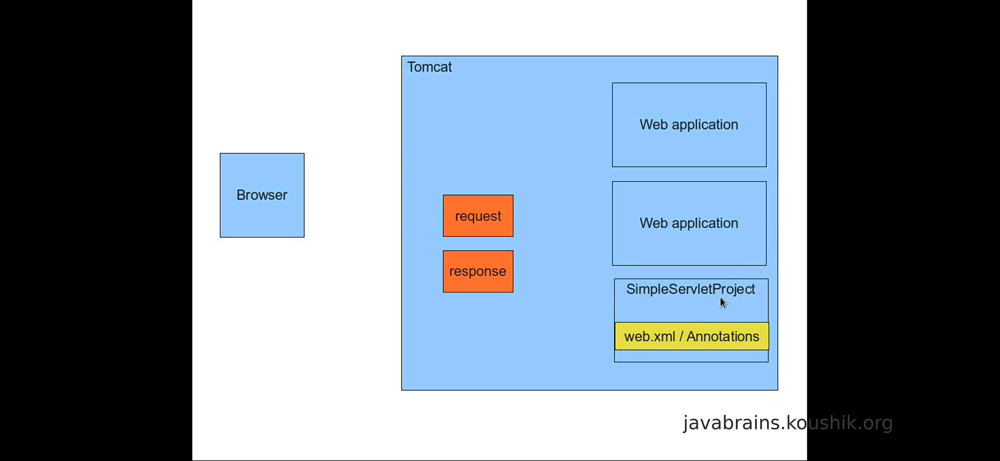
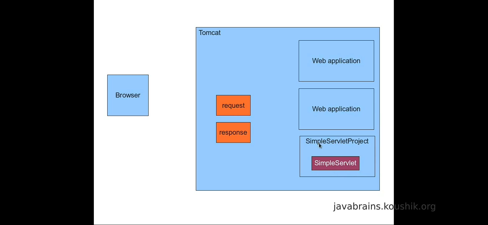
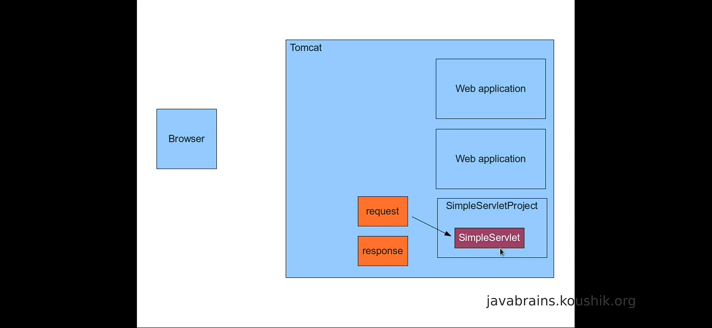
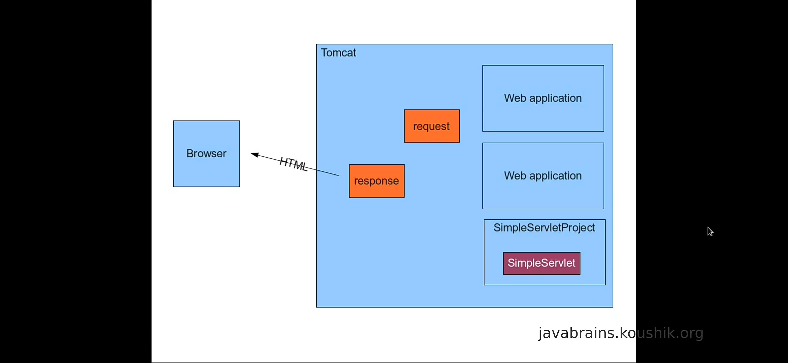

# Understanding The Servlet

1. Request From Browser

2. Tomcat Creates Request and Respond Objects

3. Tomcat Checks For WebApplication From URL

4. Checks For Web.xml Or Annotations And Decides Servlet To Run

5. Servlet Takes Input Parameters From Request Object

6. Servlet Writes Result On Response Object

7. Tomcat Returns HTML from Response Object To Browser

